# MM Modules

## Table of Contents

- [About](#about)
- [Install](#install)
- [Modules](#usage)
  - [Infinite Scroll](#infinite-scroll)
  - [Product Widget](#product-widget)
  - [Spent Summary](#spent-summary)
  - [Weather Widget](#weather-widget)


## Instalation


Download this repository and add it in your project path
it should be as follows

```sh
- project
    - app
        - code
            - Mmm
                - Core
                - InfiniteScroll
                - ProductWidget
                - SpentSummary
                - Weather
```

Enable the modules

```sh
bin/magento module:enable Mmm_Core Mmm_Weather Mmm_SpentSummary Mmm_ProductWidget Mmm_InfiniteScroll

bin/magento s:up;bin/magento s:d:c;bin/magento s:s:d -f; bin/magento c:f

```

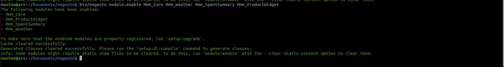

Refresh your browser and go to the back office of your store.

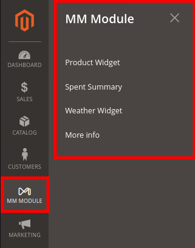

#### Observations

The environment used to develop these submitted requirements was with

- **Version:** Magento ver. 2.4.5-p1
- **Local Environment:**  [markshust/docker-magento](https://github.com/markshust/docker-magento)
- **Data:** ```bin/magento sampledata:deploy```

Post installation settings repaired

```sh

bin/magento module:disable Magento_Csp Magento_TwoFactorAuth
bin/magento config:set admin/security/session_lifetime 31536000
bin/magento config:set admin/security/use_form_key 0
bin/magento setup:up;bin/magento s:d:c;bin/magento s:s:d -f;bin/magento c:f

```

### Modules
-------------------------
#### Infinite Scroll

This module is in charge of adding the Infinite Scroll feature in the PDL of the store.

#### Settings

To enable the module you must go to
**Menu > Mm Module > Infine Scroll.**

Here you will find the necessary settings to enable and customize this module.
<a href="https://raw.githubusercontent.com/mmaximo33/Mmm_WI/main/InfiniteScroll/doc/img/settings.png" target="_blank">
  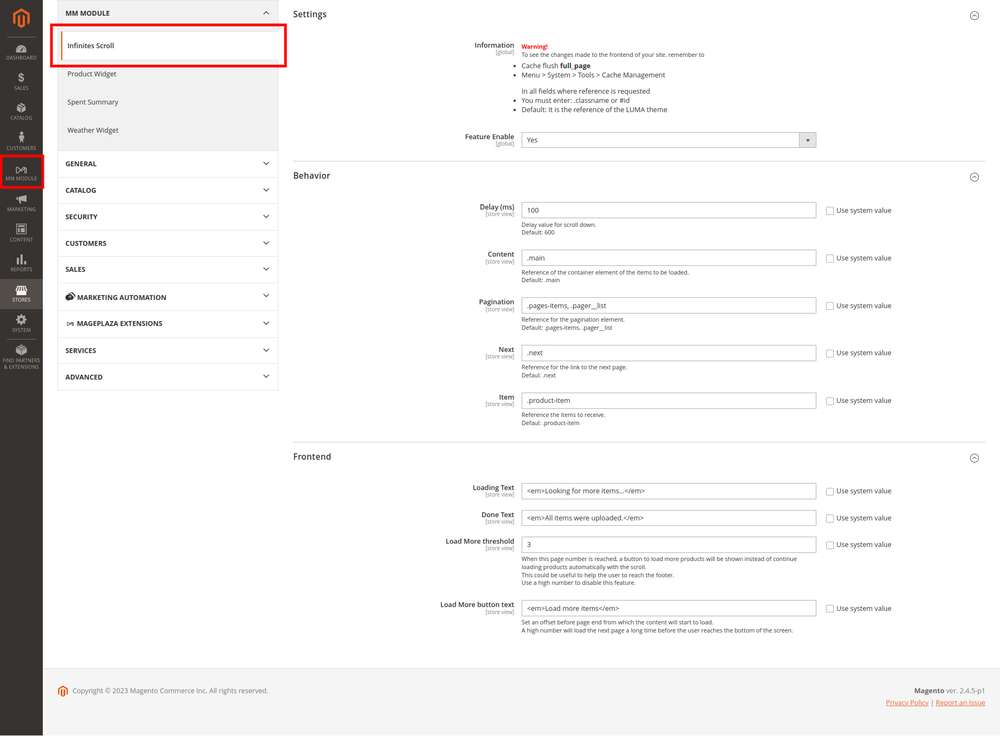
</a>

#### Frontend

<a href="https://raw.githubusercontent.com/mmaximo33/Mmm_WI/main/InfiniteScroll/doc/img/frontend.png" target="_blank">
  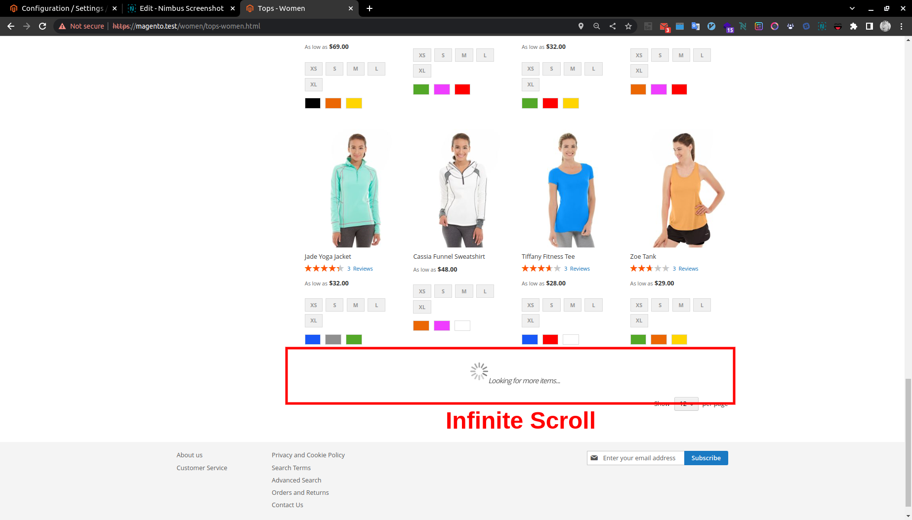
</a>

-------------------------
### Weather Widget

This module allows you to add a weather widget based on the location of the visitor.
It is displayed in the head of your store.

#### Settings

To enable the module you must go to
**Menu > Mm Module > Weather Widget.**

Here you will find the necessary settings to enable and customize this module.

**Warning:** Currently only the open-meteo.com provider is available, soon we will add new ones.
<a href="https://raw.githubusercontent.com/mmaximo33/Mmm_WI/main/Weather/doc/img/settings.png" target="_blank">
  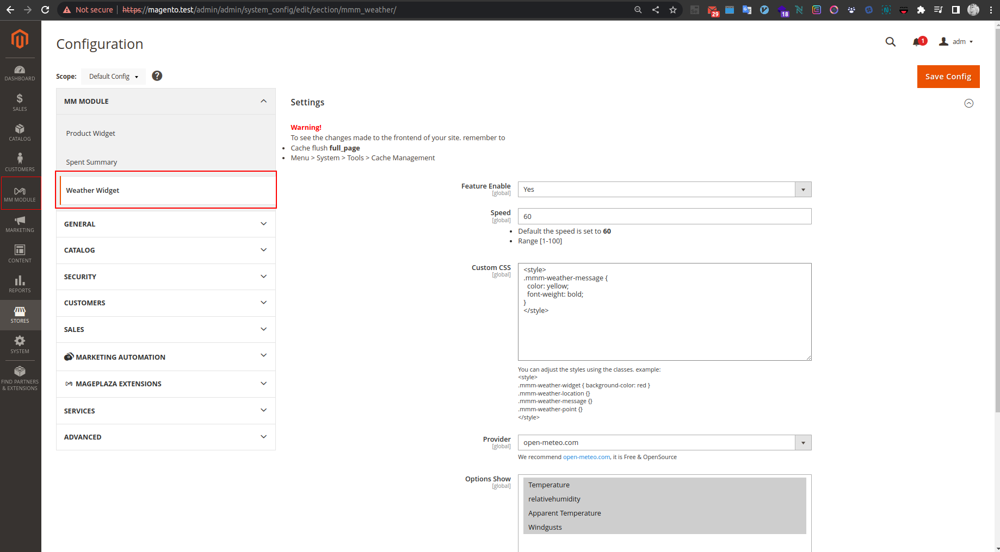
</a>

#### Frontend

After installing and enabling the module, the result is displayed as in the following image

<a href="https://raw.githubusercontent.com/mmaximo33/Mmm_WI/main/Weather/doc/img/frontend.png" target="_blank">
  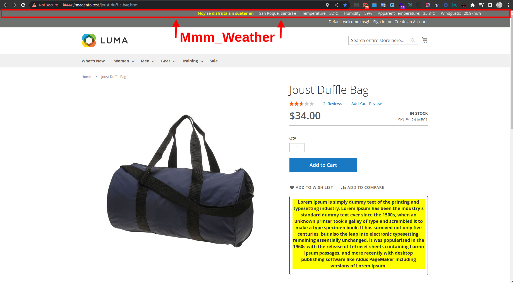
</a>

-------------------------
### Spent Summary

This module is responsible for calculating the total amount spent by a user according to their email.

#### Settings

You can find the configuration of the module from
**Menu > MM Module > Spent Summary**

**Observation**
In case you want to use this feature in a custom template from the backoffice, you can add the following code to make use of the feature
```
    {{block
        area="frontend"
        class="Mmm\SpentSummary\Block\Order\Email\TotalSpent"
        template="Mmm_SpentSummary::order/onepage/success/total_spent.phtml"
    }}
```

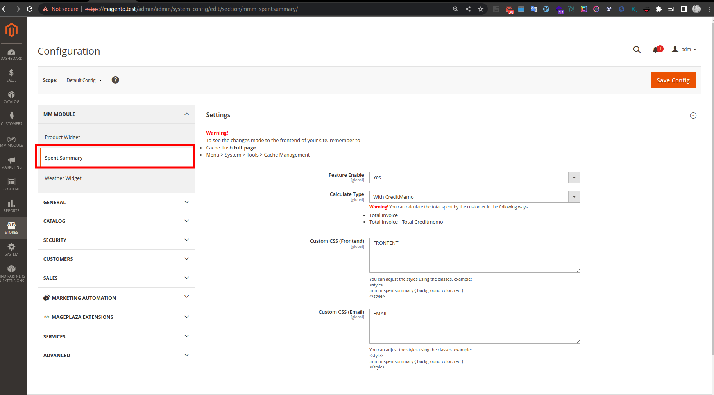
<a href="https://raw.githubusercontent.com/mmaximo33/Mmm_WI/main/SpentSummary/doc/img/frontend.png" target="_blank">
  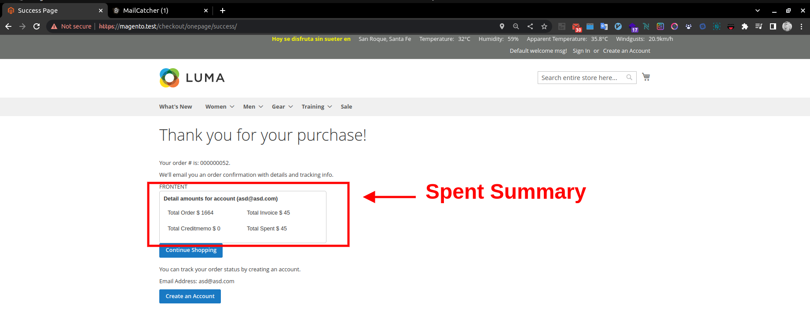
</a>

#### Frontend

After installing and enabling the module, the result is displayed as in the following image
<a href="https://raw.githubusercontent.com/mmaximo33/Mmm_WI/main/SpentSummary/doc/img/frontend.png" target="_blank">
  
</a>
<a href="https://raw.githubusercontent.com/mmaximo33/Mmm_WI/main/SpentSummary/doc/img/email.png" target="_blank">
  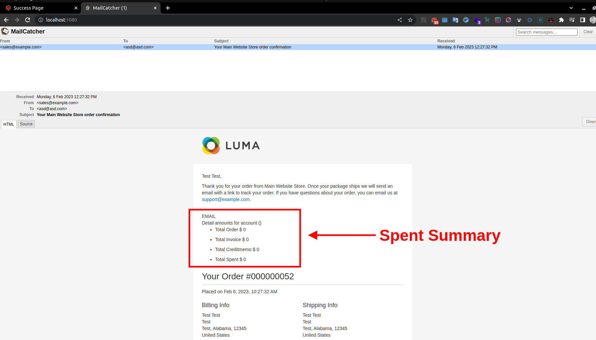
</a>

-------------------------
### Product Widget

This module adds a small widget to your store's PDP, where you can enter a small message and customize it as required.

#### Settings

You can find the configuration of the module from
**Menu > MM Module > Product Widget**

<a href="https://raw.githubusercontent.com/mmaximo33/Mmm_WI/main/ProductWidget/doc/img/settings.png" target="_blank">
  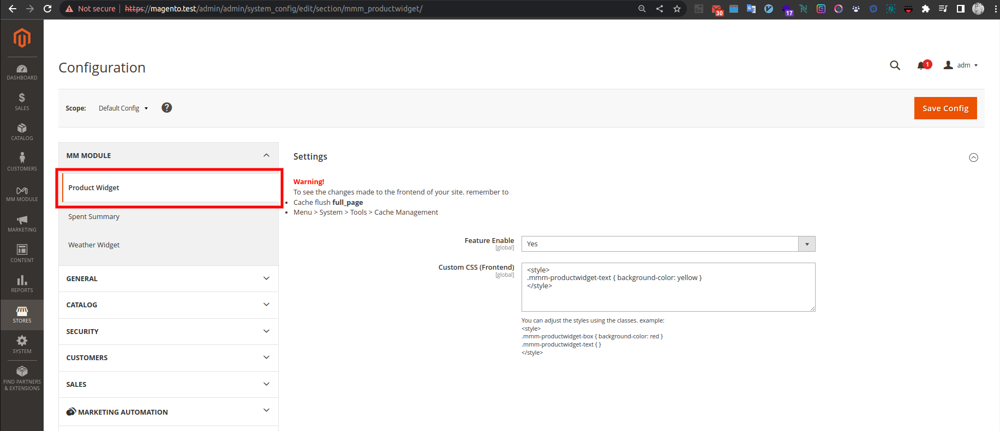
</a>

#### Frontend

After installing and enabling the module, the result is displayed as in the following image

<a href="https://raw.githubusercontent.com/mmaximo33/Mmm_WI/main/ProductWidget/doc/img/frontend.png" target="_blank">
  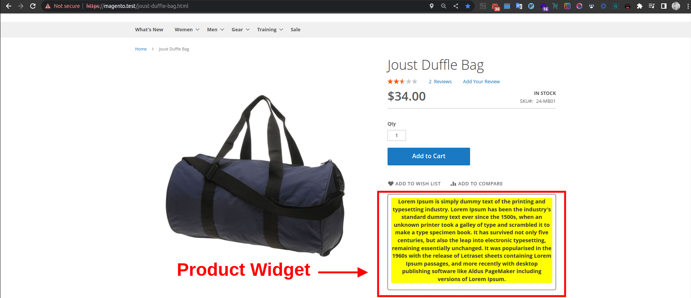
</a>